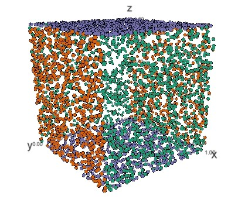

# pointshapes3d

An R package with functions to generate random points on the surfaces of simple 
3D shapes.

```
devtools::install_github("mbedward/pointshapes3d")

library(pointshapes3d)
library(threejs)

# Place 4000 random points on a unit cube
a.cube <- p3d_cube(4000)

# Display an interactive plot in a browser window,
# with the points on each pair of opposite sides
# drawn in a given colour
clr.index <- 1 + (a.cube$sides %% 3)
clrs <- c("#1b9e77", "#d95f02", "#7570b3")

scatterplot3js(a.cube$coords, color = clrs[clr.index], size = 0.2)

```


