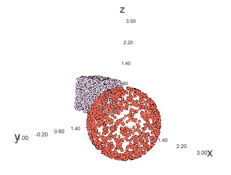

```{r, include = FALSE}
knitr::opts_chunk$set(
  collapse = TRUE,
  comment = "#>"
)
```

```{r setup}
library(pointshapes3d)
```

## First example

We will place 4000 random points on the surfaces of a unit cube.

```{r}

a.cube <- p3d_cube(4000)

# Object is a list with a matrix of point coordinates...
head(a.cube$coords)

# ...and a vector of integers (0 - 5) identifying the side
# on which each point is placed
head(a.cube$sides, 10)

```

If you have the `threejs` package installed, you can display an interactive
plot of the cube in a browser window. We will colour the points so that those
on opposite sides have the same colour.

```{r eval=FALSE}

clr.index <- 1 + (a.cube$sides %% 3)
clrs <- c("#1b9e77", "#d95f02", "#7570b3")

threejs::scatterplot3js(a.cube$coords, color = clrs[clr.index], size = 0.2)

```


## Multiple shapes

You can combine two or more shapes by concatenating their coordinate matrices.

```{r eval = FALSE}

N <- 1000
a.sphere <- p3d_sphere(N, pos = c(2, 0, 0))
all.pts <- a.sphere$coords

a.cube <- p3d_cube(N)
all.pts <- rbind(all.pts, a.cube$coords)

# Set the x, y and z limits for the plot to the same range so that
# the shapes appear undistorted
threejs::scatterplot3js(coords, size = 0.2, 
                        color = rep(c("thistle", "tomato"), each = N), 
                        xlim = c(-1,3), ylim = c(-1, 3), zlim = c(-1, 3))

```


